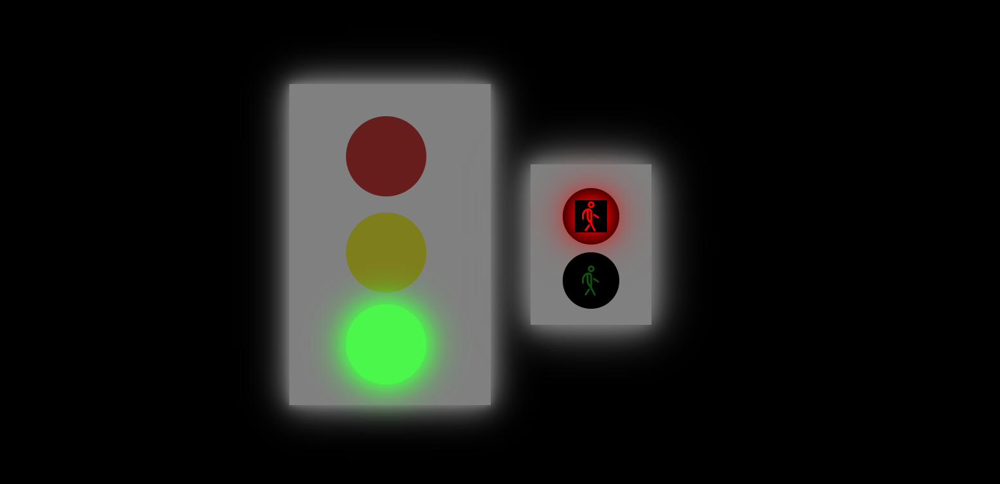

# Semáforo  |  traffic light 

 
 O objetivo principal foi criar uma aplicação interativa que reproduz o ciclo de luzes de um semáforo de trânsito. O projeto demonstra o uso combinado dessas três linguagens para controlar o comportamento e a aparência de um objeto na tela, com o JavaScript gerenciando a lógica por trás da transição das cores (vermelho, amarelo e verde)

### Tecnologias Utilizadas 
  - HTMLL
  - CSS
  - JAVASCRIPT

### Link do Projeto
[ semaforo🚦](https://semaforo-trafffic-light-web.vercel.app/)
